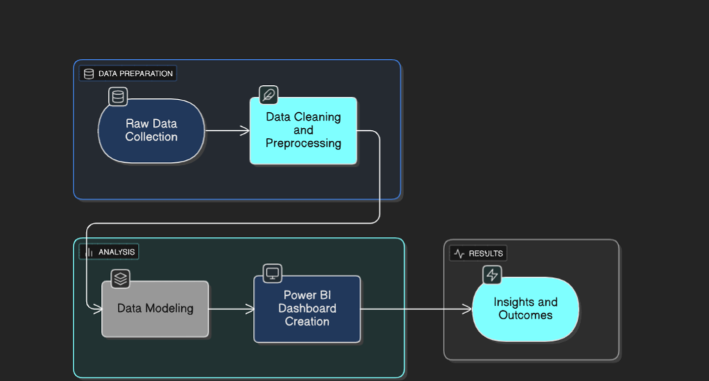
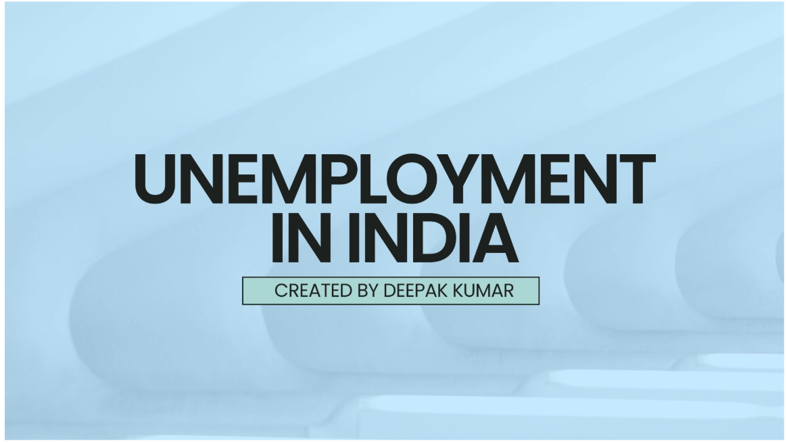
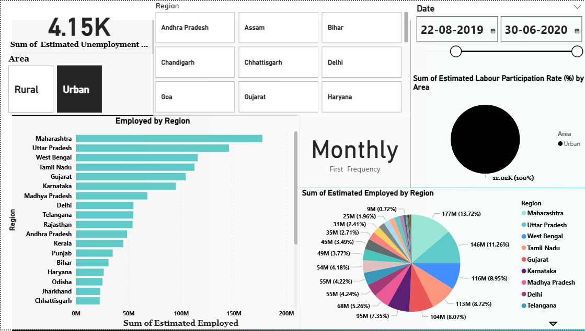

# 📊 Unemployment in India: Trends & Insights  

## 📌 Project Overview  
This project analyzes **unemployment trends in India** using **Power BI**. The goal is to explore employment patterns across states, regions, and demographics, and to provide actionable insights into workforce participation and economic challenges. By leveraging interactive dashboards, the project highlights which states contribute the most to employment and where unemployment is more prevalent.  

---

## Project Workflow  
  
*Data Pipeline: Raw data → Cleaning → Modeling → Power BI Dashboard → Insights*  

---

## 🎯 Objectives  
- Analyze unemployment rates across **different states** of India.  
- Compare **rural vs. urban unemployment** patterns.  
- Track **employment distribution by region**.  
- Identify states with **highest and lowest job participation**.  
- Provide insights into **labour force participation trends**.  

---

## 🛠️ Tools & Technologies  
- **Power BI** → For dashboards and interactive visualizations.  
- **MS Excel / CSV** → For cleaning and preprocessing.  
- **DAX (Data Analysis Expressions)** → For calculated measures and KPIs.  

---

## 📂 Dataset Information  
The dataset contains the following columns:  
- **Region** → State/Union Territory  
- **Date** → Time period of record  
- **Estimated Unemployment Rate (%)**  
- **Estimated Employed** → Number of employed individuals  
- **Estimated Labour Participation Rate (%)**  
- **Area** → Urban / Rural classification  

---

## 📊 Dashboard Features  
1. **Map Visualization** → Unemployment rate by state.  
2. **Line Chart** → Monthly unemployment rate trend.  
3. **Bar Chart (Employed by Region)** → Top states contributing to employment.  
4. **Pie Chart** → Employment distribution across regions.  
5. **Filters / Slicers** → State, date, and area (Urban/Rural).  

---

## 🔑 Insights  
- **Maharashtra, Uttar Pradesh, and West Bengal** lead in employment, contributing the largest share of the workforce.  
- **Tamil Nadu and Gujarat** also show high employment, driven by industrial and service sectors.  
- States like **Chhattisgarh, Jharkhand, and Haryana** show lower employment compared to larger states.  
- **Urban areas dominate** labour force participation compared to rural regions.  
- Employment is regionally concentrated—**top five states account for more than 50%** of the total workforce.  

---

## 🚀 Outcomes  
- Provides **policy makers** and **economists** with clarity on unemployment distribution.  
- Helps identify **regions that need more job creation and skill development initiatives**.  
- Assists **students, researchers, and analysts** in understanding socio-economic issues in India.  

---

## 📸 Dashboard Preview  
  
   

---

## 📁 Repository Structure  
```
📂 Unemployment_In_India
 ┣ 📂 Data
 ┃ ┗ unemployment_india.csv
 ┣ 📂 Dashboard
 ┃ ┗ Unemployment_India.pbix
 ┣ 📂 Images
 ┃ ┗ dashboard_preview.png
 ┣ 📄 README.md
```  

---

## 📌 Conclusion  
This project demonstrates how **data visualization** can uncover **employment and unemployment trends in India**. It highlights the power of **Power BI** in presenting insights that can guide policy-making, workforce planning, and economic development strategies.  
